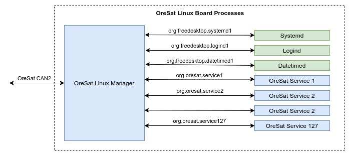

# OreSat Linux Manager (OLM)

OreSat Linux Manager is the Linux board controller / CAN interface program for
all Linux boards on OreSat. It is built ontop of [CANopenNode] and interfaces
with [Systemd], allowing the master CAN node to control everything on the board
over CAN. The OLM is ment to be a node on the CANbus, not the master node.

## Features

- Built on top of the [CANopenNode], therefor it follows the
[CANopen-Specifcations] by CiA ([CAN-in-Automation]).
- Follows the [ECSS-CANBus-Extended-Protocal] on top of CiA specs.
- Allows the CAN Network Manager to control any [daemons] on the Linux board
thru [Systemd].
- Has a app based system that uses sd-bus (systemd dbus) for DBus communication
to OreSat [daemons].
- Allows other daemons with oresat-linux-manager apps to read/write to the CAN
object dictionary over dbus.
- Allows the other processes/daemons to be written in any language that has a
DBus library or a DBus binding. A lot of languages do have DBus support, See
[freedesktop DBus Bindings] for a DBus supported languague list.

## Dependices

### To compile

- For Debian:`apt install git libsystemd-dev cmake make gcc doxygen pkg-config`
  - optional: `ninja-build`
- For Arch: `pacman -S git systemd-libs cmake make gcc doxygen pkgconfig`
  - optional: `ninja`

### To run

- For Debian: `apt install libsystemd-dev`
- For Arch: `pacman -S systemd-libs`

## How to use

- Compiling
  - `$ cd build`
  - `$ cmake -DBOARD=<board> ..` or `$ cmake -GNinja -DBOARD=<board> ..`
  - `$ make` or `$ ninja`
- Optional cmake flags, 1st option in `[ ]` is default when not specified:
  - `-DCMAKE_BUILD_TYPE=[Debug|Release]` to turn the -g -Wall cflags on/off
- Running OLM
  - `$ sudo ./oresat-linux-manager`
  - `$ ./oresat-linux-manager -h` for help message
- Building deb binary package
  - `$ make package` or`$ ninja package`

## Making a new board

- `$ cp -r src/boards/generic src/boards/<new_board_name>`
- modify `$ src/boards/<new_board_name>/board_main.c` as needed
- modify `$ src/boards/<new_board_name>/object_dictionary/*.xdd` with
[libedssharp] as needed. Make sure to save the `.xdd`, `.eds`, `.md`, and
`CO_OD.*` files when editing the OD.

## Useful References

- [CAN-Wikipedia]
- [Daemons]
- [Systemd]
- [Systemd-DBus]
- [DBus-Specifcations]
- [CANopen-Specifcations]
- [ECSS-CANBus-Extended-Protocal]

<!-- References -->
[CAN-Wikipedia]:https://en.wikipedia.org/wiki/CAN_bus
[Daemons]:https://www.freedesktop.org/software/systemd/man/daemon.html
[Systemd]:https://freedesktop.org/wiki/Software/systemd/
[Systemd-DBus]:https://www.freedesktop.org/wiki/Software/systemd//
[DBus-Specifcations]:https://.freedesktop.org/doc/dbus-specification.html
[CANopen-Specifcations]:https://www.can-cia.org/groups/specifications/
[ECSS-CANBus-Extended-Protocal]:https://ecss.nl/standard/ecss-e-st-50-15c-space-engineering-canbus-extension-protocol-1-may-2015/
[CAN-in-Automation]:https://can-cia.org/
[freedesktop DBus Bindings]:https://www.freedesktop.org/wiki/Software/DBusBindings/

<!-- Other Repos -->
[CANopenNode]:https://github.com/CANopenNode/CANopenNode
[libedssharp]:https://github.com/robincornelius/libedssharp
