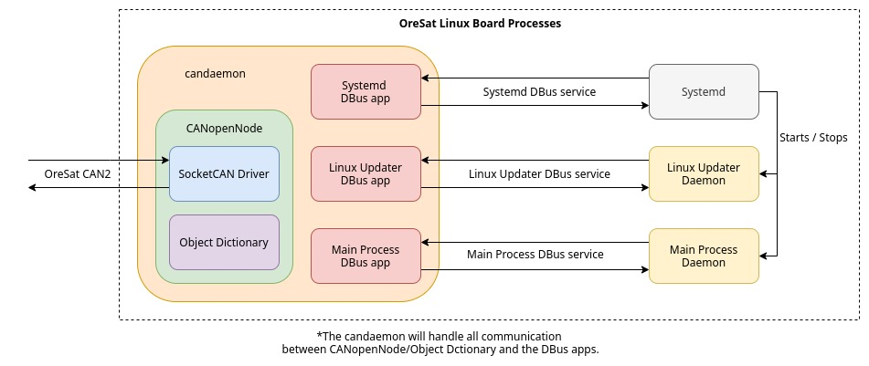

# Oresat Linux CANdaemon

The CANdaemon is based off of [CANopenSocket], but with multiple  apps to commicate and control other daemons.
The CANdaemon can commicate with Systemd, the Oresat Linux Updater daemon, and the main process daemon ([GPS], [StarTracker], [OreSatLive], or the Cirrus Flux Camera daemon depending on which board).
It will act as the CANbus front end for all processes on an OreSat Linux board. 
The CANdaemon is ment to be a node on the CANbus, not the Network Manager.

## Features
- Built on top of the [CANopenNode], therefor it follows the [CANopen-Specifcations] by CiA ([CAN-in-Automation]).
- Follows the [ECSS-CANBus-Extended-Protocal] on top of CiA specs.
- Allows the CAN Network Manager to control any [daemons] on the Linux board thru [Systemd].
- Allows the CAN Network Manager to control the power options thru [Systemd].
- Allows other daemons with candaemon apps to read/write to the CAN object dictionary over dbus.
- Uses sd-bus (systemd dbus) for DBus communication to OreSat [daemons].
- Allows the other processes/daemons to be written in any language that has a DBus library or a DBus binding. A lot of languages do have DBus support, See [freedesktop DBus Bindings](https://www.freedesktop.org/wiki/Software/DBusBindings/) for a DBus supported languague list.

## Directory Layout 
- **src** - Holds an CANdaemon app for each OreSat Linux board
    - **boards** - Holds an CANdaemon app for each OreSat Linux board
    - **CANopenNode** - The git submodule for CANopenNode
    - **common** - Common source code, regardless of which board is enabled.
    - **socketCAN** - CANopenNode SocketCAN driver
- **docs** - Documentation for CANdaemon

## Dependices
### To compile
- For Debian:`apt install git libsystemd-dev cmake make gcc`
    - optional: `ninja-build`
- For Arch: `pacman -S git systemd-libs cmake make gcc`
    - optional: `ninja`
### To run
- For Debian: `apt install libsystemd-dev`
- For Arch: `pacman -S systemd-libs`

## How to use
- Compiling
    - `cd build`
    - `cmake -DBOARD=<board> ..` or `cmake -GNinja -DBOARD=<board> ..`
    - `make` or `ninja`
- Optional cmake flags, 1st option in `[ ]` is default when not specified:
    - `-DCMAKE_BUILD_TYPE=[Debug|Release]` to turn the -g -Wall cflags on/off
    - `-DSYSTEMD_APP=[on|off]` to turn systemd app on/off
    - `-DLINUX_UPDATER_APP=[on|off]` to turn Linux updater app on/off
    - `-DMAIN_PROCESS_APP=[on|off]` to turn main process app on/off
- Running CANdaemon
    - `./candaemon` as a process
    - `./candaemon -d` as a daemon
    - `./candaemon -l <device>` to specify device. Defaults to can0.
- Installing binary and daemon service file (usefull for testing)
    - `sudo make install` or `sudo ninja install`
- Building deb binary package on a beaglebone (or debian based armhf system)
    - `sudo make package` or`sudo ninja package`

## Making a new board
- Read [design_guide_candaemon_app.md](docs/design_guide_candaemon_app.md)
- `cp -r boards/template boards/<new_board_name>`
- modify /boards/<new_board_name>/appilcation.* as needed
- modify /boards/<new_board_name>/objDict with [libedssharp] as needed

## Useful References
- [CAN-Wikipedia]
- [CANopenSocket]
- [Daemons]
- [Systemd]
- [Systemd-DBus]
- [DBus-Specifcations]
- [CANopen-Specifcations]
- [ECSS-CANBus-Extended-Protocal]

<!-- Other oresat repos -->
[GPS]:https://github.com/oresat/oresat-gps-software
[StarTracker]:https://github.com/oresat/oresat-star-tracker
[OreSatLive]:https://github.com/oresat/oresat-dxwifi-software

<!-- References -->
[CAN-Wikipedia]:https://en.wikipedia.org/wiki/CAN_bus
[CANopenSocket]:https://github.com/CANopenNode/CANopenSocket
[CANopenNode]:https://github.com/CANopenNode/CANopenNode
[Daemons]:https://www.freedesktop.org/software/systemd/man/daemon.html
[Systemd]:https://freedesktop.org/wiki/Software/systemd/
[Systemd-DBus]:https://www.freedesktop.org/wiki/Software/systemd//
[DBus-Specifcations]:https://.freedesktop.org/doc/dbus-specification.html
[CANopen-Specifcations]:https://www.can-cia.org/groups/specifications/
[ECSS-CANBus-Extended-Protocal]:https://ecss.nl/standard/ecss-e-st-50-15c-space-engineering-canbus-extension-protocol-1-may-2015/
[CAN-in-Automation]:https://can-cia.org/

<!-- Other --> 
[libedssharp]:https://github.com/robincornelius/libedssharp
